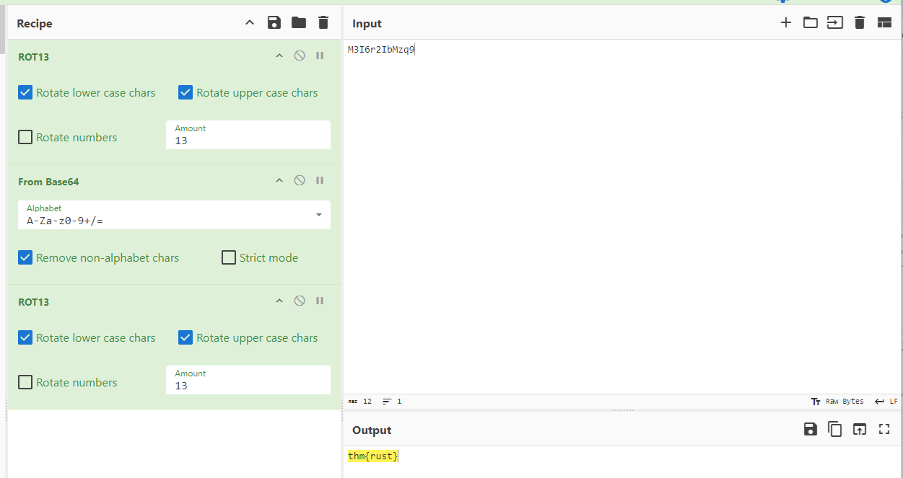

This [room](https://tryhackme.com/r/room/rust) was a whirlwind introduction to Rust, hitting the high notes before unceremoniously dropping us into the challenge, which has us manipulating a challenge string. Initially, to just complete the room, I cheated a bit, and used cyberchef to get the flag.  This, of course, is highly unsatisfactory, and I want to right that wrong by completing this challenge the right way, with Rust. To do so, we need to dig into how to work with strings, and how to use Rust's conventions to not only solve the challenge, but do it the way things should be done in the language.

I found two resources very helpful in completing this task, [Command line apps in Rust](https://rust-cli.github.io/book/tutorial/setup.html), and Rust's own [The Rust Programming Language](https://doc.rust-lang.org/book/).

As I mentioned, when I first went through this room, I worked my way through all the tasks, but when I got to the Challenge task, and saw that to get the flag, all we needed to go was `ROT-13 -> BASE64 -> ROT-13`, I used CyberChef to get the flag and moved on.


Too Easy! 

Below is the first iteration of a Rust program that decrypts the given string and returns the flag. The final version keeps the encrypted string in a file, opens the file, reads the encrypted line, and then applies ROT13 > Base64 Decode > ROT13 to get the flag.

```
 1 use base64::{engine::general_purpose, Engine as _};
 2 
 3 fn decode_base64(input: &str) -> String {
 4     let decoded_bytes = general_purpose::STANDARD.decode(input).expect("Failed to decode base64");
 5     String::from_utf8(decoded_bytes).expect("Failed to convert bytes to string")
 6 }
 7 
 8 fn rot13(input: &str) -> String {
 9     input
 10         .chars()
 11         .map(|c| {
 12             if c.is_ascii_alphabetic() {
 13                 let base = if c.is_ascii_lowercase() { b'a' } else { b'A' };
 14                 let rotated = (c as u8 - base + 13) % 26 + base;
 15                 rotated as char
 16             } else {
 17                 c  // Non-alphabetic characters remain unchanged
 18             }
 19         })
 20         .collect()
 21 }
 22 
 23 fn main() {
 24     let cipher = "M3I6r2IbMzq9";
 25     let encoded_string = rot13(cipher);
 26 
 27     // Decode the Base64 string and print it
 28     let decoded_string = decode_base64(&encoded_string);
 29 
 30     // Recover plaintext and read the flag
 31     let flag = rot13(&decoded_string);
 32     println!("Flag: {}", flag);
 33 }
```
